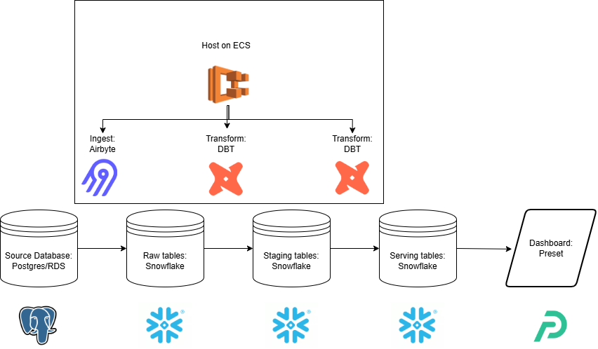
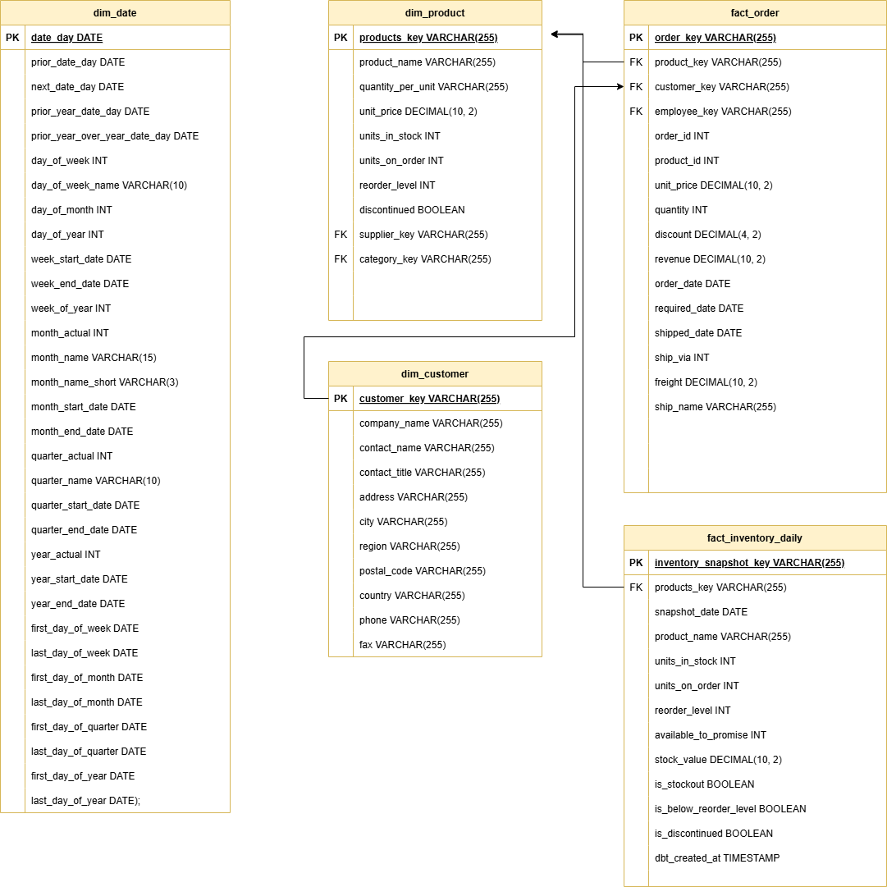
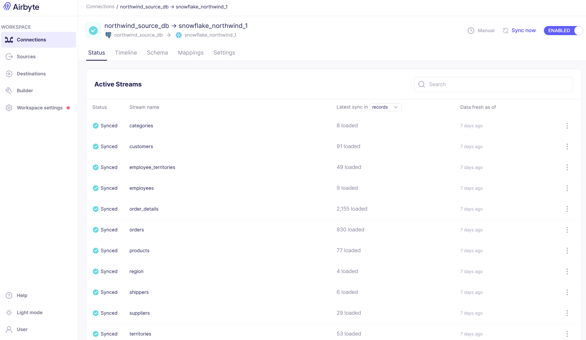
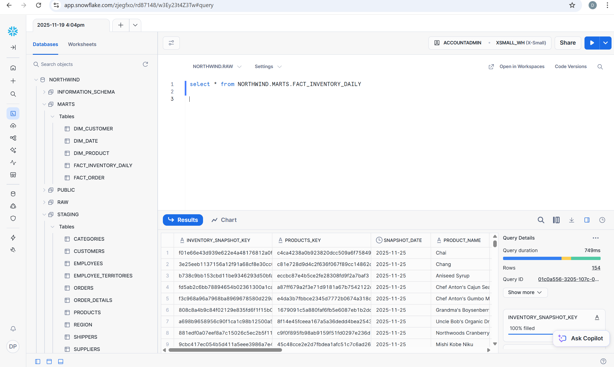
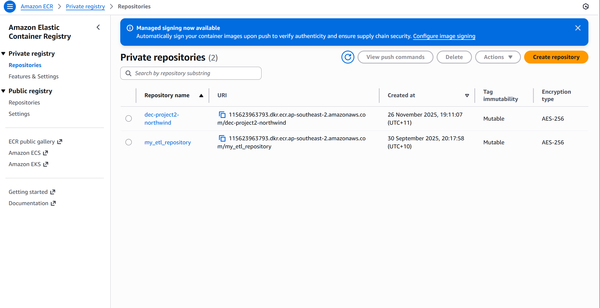
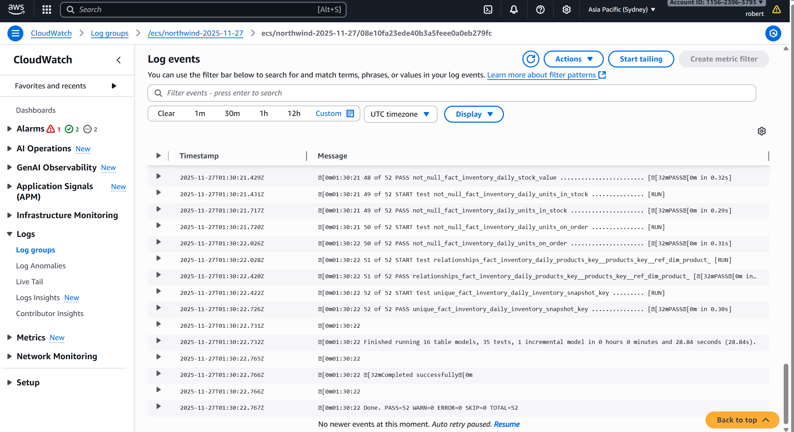
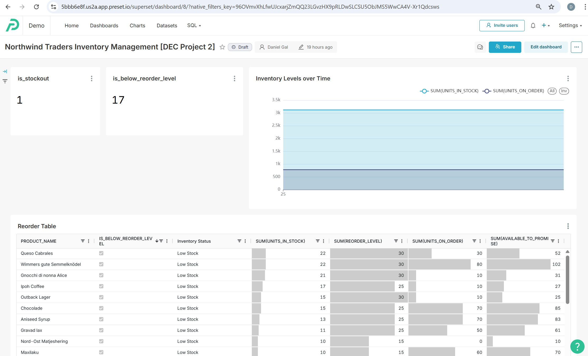
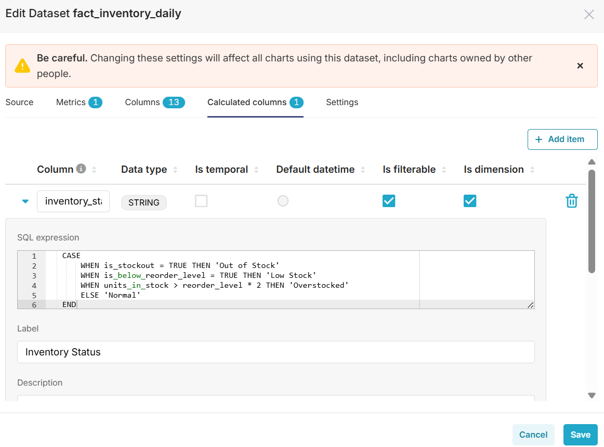

# Daniel's DEC Project 2 - Northwind Traders

## Context
The Northwind database, originally created by Microsoft and used as the basis for their tutorials in a variety of database products for decades, is being used as the source dataset for this project. It contains the sales data for a fictitious company called "Northwind Traders," which imports and exports specialty foods from around the world.


The consumers of serving data from this pipeline are operations managers of Northwind Traders, enabling them to optimise business processes with and inventory management. Specifically:

Minimize stockouts while reducing excess inventory carrying costs 
- Stock turnover rate by product/category
- Days of inventory on hand
- Reorder point analysis
- Products frequently going out of stock (UnitsInStock = 0)
- Slow-moving vs. fast-moving inventory

Improve demand prediction to optimize inventory and procurement
- Sales velocity trends by product/category
- Seasonal demand patterns
- Customer order frequency and patterns
- Product lifecycle analysis
- Regional demand variations

Inventory_snapshot_daily is a periodic snapshot fact table that was built to answer most of these questions however due to the static nature of the source data it wasn't possible to create very informatative charts. A future opportunity could be to develop some mock source data to better showcase the use of this table.   

## Solution architecture
### ELT Pipeline (technologies used)


### ER Diagram



## Running instructions

NOTE it is a pre-requisite to have both a Snowflake and Airbyte account

### Ingestion - Airbyte

1. Download source Northwind db files from https://github.com/pthom/northwind_psql/tree/master and create a new database in PgAdmin4 restore from SQL file

2. Create a connection between the source db in Postgres and destination in Snowflake and run the sync job

3. Refresh the database explorer in Snowflake to ensure the source database has been ingested 


### Transformation - DBT


1. Open your terminal and activate your virtual environment  e.g. `conda activate dec`
1. Install dbt:

```
pip install dbt-core==1.7.0
pip install dbt-snowflake==1.7.0
```

3. Verify install:

```
dbt --version
```

4. Run `dbt init` to create a new dbt project, adding dummy values when prompted
5. Set environemnt variables in profiles yml file as per your Snowflake account
6. cd to dbt project folder and run 'dbt debug' to verify connection
7. Run dbt run to materialize new staging and modelling tables in Snowflake  


## Screenshots


### Airbyte ingestion


### Snowflake



### DBT hosted on ECR/ECS

ECR


ECS logs



### Dashboard 
(https://5bbb6e8f.us2a.app.preset.io/superset/dashboard/8/?native_filters_key=96OVmvXhLfwUJcxarjZmQQ23LGvzHX9pRLDwSLCSU5ObJMS5WwCA4V-Xr1Qdcsws)



### Semantic Data Layer


